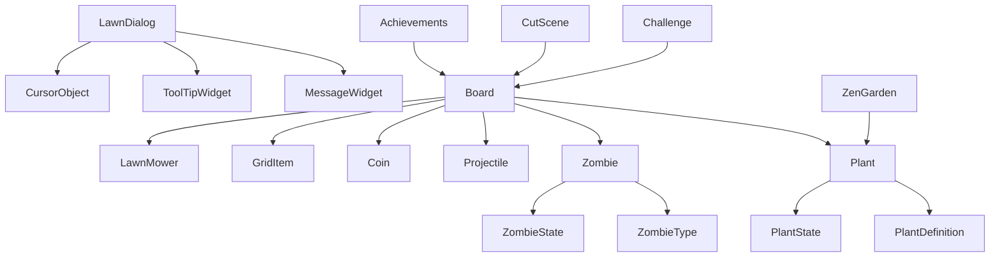

# 植物大战僵尸 Lawn 目录结构分析

## 核心游戏对象
### Board (游戏主面板)
- `Board.cpp/h`
  - 游戏场景管理
  - 植物和僵尸的生成与交互
  - 游戏状态控制
  - 资源管理（阳光、金币等）
  - 用户输入处理
  - 游戏事件处理

### Plant (植物系统)
- `Plant.cpp/h`
  - 植物基础属性定义
  - 植物行为实现
  - 植物动画控制
  - 植物状态管理
  - 植物分类系统
    - 夜间植物
    - 水生植物
    - 飞行植物
    - 升级植物

### Zombie (僵尸系统)
- `Zombie.cpp/h`
  - 僵尸基础属性
  - 僵尸行为实现
  - 僵尸动画控制
  - 僵尸状态管理
  - 僵尸类型系统

## 游戏机制
### 投射物系统
- `Projectile.cpp/h`
  - 子弹实现
  - 投射物行为
  - 碰撞检测

### 资源系统
- `Coin.cpp/h`
  - 金币系统
  - 资源收集
  - 资源显示

### 网格系统
- `GridItem.cpp/h`
  - 网格物品管理
  - 特殊物品实现
  - 地形效果

### 割草机系统
- `LawnMower.cpp/h`
  - 割草机行为
  - 触发机制
  - 动画效果

## 游戏模式
### 挑战模式
- `Challenge.cpp/h`
  - 特殊关卡
  - 挑战规则
  - 成就系统

### 过场动画
- `CutScene.cpp/h`
  - 剧情展示
  - 动画控制
  - 事件触发

### 成就系统
- `Achievements.cpp/h`
  - 成就解锁
  - 进度追踪
  - 奖励系统

### 禅境花园
- `ZenGarden.cpp/h`
  - 植物培养
  - 需求系统
  - 成长机制

## UI组件
### 对话框系统
- `LawnDialog.cpp/h`
  - 基础对话框
  - 界面管理
  - 交互控制

### 消息系统
- `MessageWidget.cpp/h`
  - 消息显示
  - 提示系统
  - 动画效果

### 工具提示
- `ToolTipWidget.cpp/h`
  - 提示信息
  - 显示控制
  - 位置管理

### 光标系统
- `CursorObject.cpp/h`
  - 鼠标光标
  - 交互反馈
  - 状态显示

### 种子包系统
- `SeedPacket.cpp/h`
  - 植物选择
  - 冷却显示
  - 资源消耗

## 系统功能
### 通用功能
- `LawnCommon.cpp/h`
  - 通用工具函数
  - 辅助功能
  - 常量定义

### 游戏对象基类
- `GameObject.cpp/h`
  - 基础属性
  - 通用方法
  - 生命周期管理

## 文件关系

## 核心功能流程
1. 游戏初始化
   - Board创建
   - 资源加载
   - 场景设置

2. 游戏循环
   - 用户输入处理
   - 对象更新
   - 碰撞检测
   - 渲染显示

3. 植物系统
   - 种植
   - 生长
   - 攻击
   - 死亡

4. 僵尸系统
   - 生成
   - 移动
   - 攻击
   - 死亡

5. 资源管理
   - 阳光收集
   - 金币管理
   - 植物选择

6. 游戏状态
   - 暂停/继续
   - 存档/读档
   - 关卡切换 